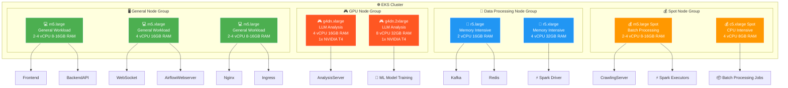

# EKS 노드 그룹 구성

```mermaid
graph TB
    subgraph EKSCluster["☸️ EKS Cluster"]
        subgraph GeneralNodeGroup["🖥️ General Node Group"]
            GeneralNode1[💻 m5.large<br/>General Workload<br/>2-4 vCPU 8-16GB RAM]
            GeneralNode2[💻 m5.xlarge<br/>General Workload<br/>4 vCPU 16GB RAM]
            GeneralNode3[💻 m5.large<br/>General Workload<br/>2-4 vCPU 8-16GB RAM]
        end
        
        subgraph GPUNodeGroup["🎮 GPU Node Group"]
            GPUNode1[🎮 g4dn.xlarge<br/>LLM Analysis<br/>4 vCPU 16GB RAM<br/>1x NVIDIA T4]
            GPUNode2[🎮 g4dn.2xlarge<br/>LLM Analysis<br/>8 vCPU 32GB RAM<br/>1x NVIDIA T4]
        end
        
        subgraph DataNodeGroup["💾 Data Processing Node Group"]
            DataNode1[💾 r5.large<br/>Memory Intensive<br/>2 vCPU 16GB RAM]
            DataNode2[💾 r5.xlarge<br/>Memory Intensive<br/>4 vCPU 32GB RAM]
        end
        
        subgraph SpotNodeGroup["💰 Spot Node Group"]
            SpotNode1[💰 m5.large Spot<br/>Batch Processing<br/>2-4 vCPU 8-16GB RAM]
            SpotNode2[💰 c5.xlarge Spot<br/>CPU Intensive<br/>4 vCPU 8GB RAM]
        end
    end
    
    %% Workload placement
    GeneralNode1 --> Frontend
    GeneralNode1 --> BackendAPI
    GeneralNode2 --> WebSocket
    GeneralNode2 --> AirflowWebserver
    GeneralNode3 --> Nginx
    GeneralNode3 --> Ingress
    
    GPUNode1 --> AnalysisServer
    GPUNode2 --> MLTraining[🤖 ML Model Training]
    
    DataNode1 --> Kafka
    DataNode1 --> Redis
    DataNode2 --> SparkDriver[⚡ Spark Driver]
    
    SpotNode1 --> CrawlingServer
    SpotNode1 --> SparkExecutor[⚡ Spark Executors]
    SpotNode2 --> BatchJobs[📦 Batch Processing Jobs]
    
    classDef general fill:#4CAF50,stroke:#fff,stroke-width:2px,color:#fff
    classDef gpu fill:#FF5722,stroke:#fff,stroke-width:2px,color:#fff
    classDef data fill:#2196F3,stroke:#fff,stroke-width:2px,color:#fff
    classDef spot fill:#FF9800,stroke:#fff,stroke-width:2px,color:#fff
    
    class GeneralNode1,GeneralNode2,GeneralNode3 general
    class GPUNode1,GPUNode2 gpu
    class DataNode1,DataNode2 data
    class SpotNode1,SpotNode2 spot
```