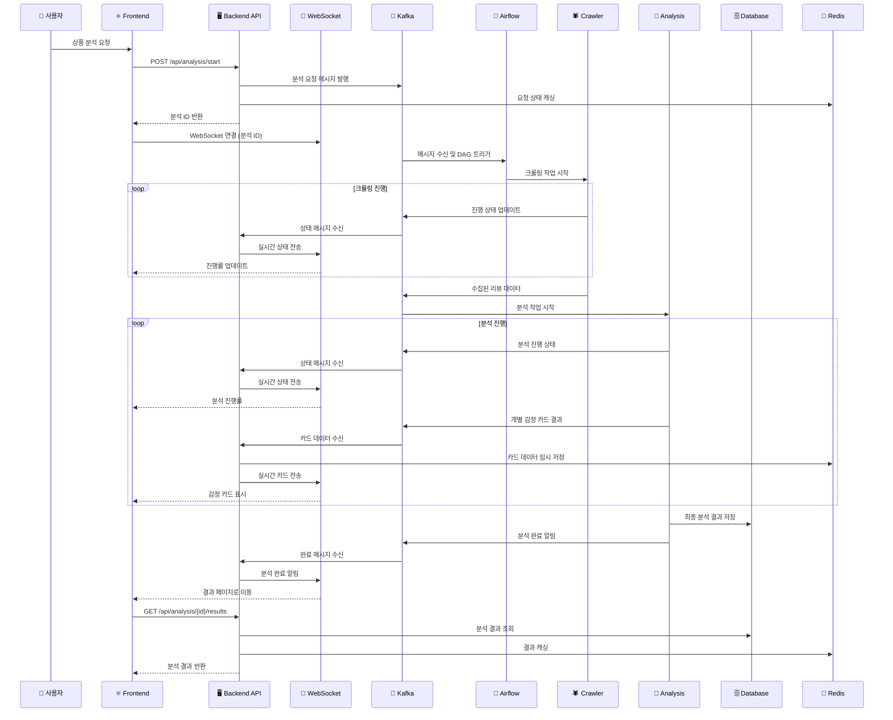

# 데이터 플로우 다이어그램

```mermaid
sequenceDiagram
    participant User as 👤 사용자
    participant Frontend as ⚛️ Frontend
    participant API as 🖥️ Backend API
    participant WS as 🔌 WebSocket
    participant Kafka as 📨 Kafka
    participant Airflow as 🌊 Airflow
    participant Crawler as 🕷️ Crawler
    participant Analysis as 🧠 Analysis
    participant DB as 🗄️ Database
    participant Cache as 🔴 Redis
    
    User->>Frontend: 상품 분석 요청
    Frontend->>API: POST /api/analysis/start
    API->>Kafka: 분석 요청 메시지 발행
    API->>Cache: 요청 상태 캐싱
    API-->>Frontend: 분석 ID 반환
    
    Frontend->>WS: WebSocket 연결 (분석 ID)
    
    Kafka->>Airflow: 메시지 수신 및 DAG 트리거
    Airflow->>Crawler: 크롤링 작업 시작
    
    loop 크롤링 진행
        Crawler->>Kafka: 진행 상태 업데이트
        Kafka->>API: 상태 메시지 수신
        API->>WS: 실시간 상태 전송
        WS-->>Frontend: 진행률 업데이트
    end
    
    Crawler->>Kafka: 수집된 리뷰 데이터
    Kafka->>Analysis: 분석 작업 시작
    
    loop 분석 진행
        Analysis->>Kafka: 분석 진행 상태
        Kafka->>API: 상태 메시지 수신
        API->>WS: 실시간 상태 전송
        WS-->>Frontend: 분석 진행률
        
        Analysis->>Kafka: 개별 감정 카드 결과
        Kafka->>API: 카드 데이터 수신
        API->>Cache: 카드 데이터 임시 저장
        API->>WS: 실시간 카드 전송
        WS-->>Frontend: 감정 카드 표시
    end
    
    Analysis->>DB: 최종 분석 결과 저장
    Analysis->>Kafka: 분석 완료 알림
    Kafka->>API: 완료 메시지 수신
    API->>WS: 분석 완료 알림
    WS-->>Frontend: 결과 페이지로 이동
    
    Frontend->>API: GET /api/analysis/{id}/results
    API->>DB: 분석 결과 조회
    API->>Cache: 결과 캐싱
    API-->>Frontend: 분석 결과 반환
```