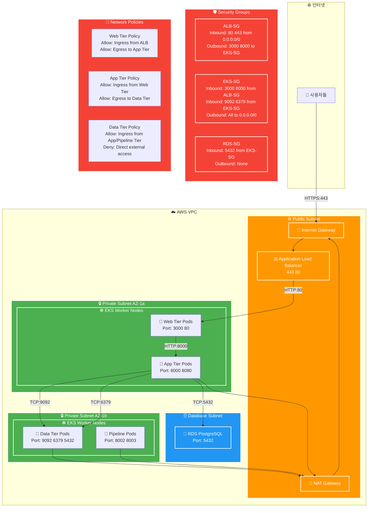

# 네트워크 보안 다이어그램

```mermaid
graph TB
    subgraph Internet["🌐 인터넷"]
        Users[👥 사용자들]
    end
    
    subgraph AWS["☁️ AWS VPC"]
        subgraph PublicSubnet["🌐 Public Subnet"]
            IGW[🚪 Internet Gateway]
            ALB[⚖️ Application Load Balancer<br/>443 80]
            NAT[🚪 NAT Gateway]
        end
        
        subgraph PrivateSubnet1["🔒 Private Subnet AZ-1a"]
            subgraph EKSNodes1["☸️ EKS Worker Nodes"]
                WebPods1[📱 Web Tier Pods<br/>Port: 3000 80]
                AppPods1[🔧 App Tier Pods<br/>Port: 8000 8080]
            end
        end
        
        subgraph PrivateSubnet2["🔒 Private Subnet AZ-1b"]
            subgraph EKSNodes2["☸️ EKS Worker Nodes"]
                DataPods2[💾 Data Tier Pods<br/>Port: 9092 6379 5432]
                PipelinePods2[🔄 Pipeline Pods<br/>Port: 8002 8003]
            end
        end
        
        subgraph DatabaseSubnet["🗄️ Database Subnet"]
            RDS[🐘 RDS PostgreSQL<br/>Port: 5432]
        end
    end
    
    %% Network flows
    Users -->|HTTPS:443| IGW
    IGW --> ALB
    ALB -->|HTTP:80| WebPods1
    WebPods1 -->|HTTP:8000| AppPods1
    AppPods1 -->|TCP:9092| DataPods2
    AppPods1 -->|TCP:6379| DataPods2
    AppPods1 -->|TCP:5432| RDS
    
    %% Outbound internet access
    AppPods1 --> NAT
    DataPods2 --> NAT
    PipelinePods2 --> NAT
    NAT --> IGW
    
    %% Security Groups
    subgraph SecurityGroups["🛡️ Security Groups"]
        ALBSG[ALB-SG<br/>Inbound: 80 443 from 0.0.0.0/0<br/>Outbound: 3000 8000 to EKS-SG]
        EKSSG[EKS-SG<br/>Inbound: 3000 8000 from ALB-SG<br/>Inbound: 9092 6379 from EKS-SG<br/>Outbound: All to 0.0.0.0/0]
        RDSSG[RDS-SG<br/>Inbound: 5432 from EKS-SG<br/>Outbound: None]
    end
    
    %% Network Policies
    subgraph NetworkPolicies["🔐 Network Policies"]
        WebPolicy[Web Tier Policy<br/>Allow: Ingress from ALB<br/>Allow: Egress to App Tier]
        AppPolicy[App Tier Policy<br/>Allow: Ingress from Web Tier<br/>Allow: Egress to Data Tier]
        DataPolicy[Data Tier Policy<br/>Allow: Ingress from App/Pipeline Tier<br/>Deny: Direct external access]
    end
    
    classDef public fill:#FF9800,stroke:#fff,stroke-width:2px,color:#fff
    classDef private fill:#4CAF50,stroke:#fff,stroke-width:2px,color:#fff
    classDef database fill:#2196F3,stroke:#fff,stroke-width:2px,color:#fff
    classDef security fill:#F44336,stroke:#fff,stroke-width:2px,color:#fff
    
    class PublicSubnet,IGW,ALB,NAT public
    class PrivateSubnet1,PrivateSubnet2,EKSNodes1,EKSNodes2 private
    class DatabaseSubnet,RDS database
    class SecurityGroups,NetworkPolicies,ALBSG,EKSSG,RDSSG security
```