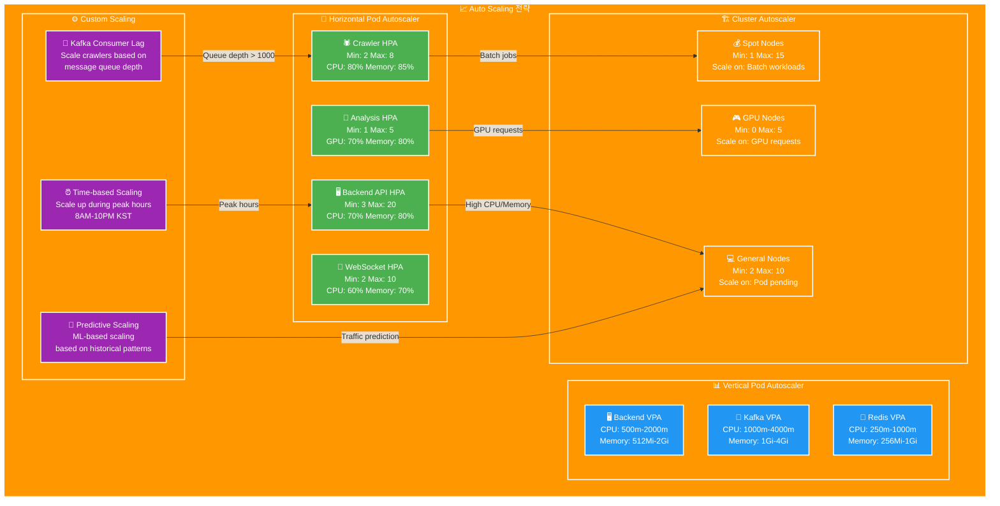

# Auto Scaling 전략

```mermaid
graph TB
    subgraph Scaling["📈 Auto Scaling 전략"]
        subgraph HPA["🔄 Horizontal Pod Autoscaler"]
            BackendHPA[🖥️ Backend API HPA<br/>Min: 3 Max: 20<br/>CPU: 70% Memory: 80%]
            WebSocketHPA[🔌 WebSocket HPA<br/>Min: 2 Max: 10<br/>CPU: 60% Memory: 70%]
            CrawlerHPA[🕷️ Crawler HPA<br/>Min: 2 Max: 8<br/>CPU: 80% Memory: 85%]
            AnalysisHPA[🧠 Analysis HPA<br/>Min: 1 Max: 5<br/>GPU: 70% Memory: 80%]
        end
        
        subgraph VPA["📊 Vertical Pod Autoscaler"]
            BackendVPA[🖥️ Backend VPA<br/>CPU: 500m-2000m<br/>Memory: 512Mi-2Gi]
            KafkaVPA[📨 Kafka VPA<br/>CPU: 1000m-4000m<br/>Memory: 1Gi-4Gi]
            RedisVPA[🔴 Redis VPA<br/>CPU: 250m-1000m<br/>Memory: 256Mi-1Gi]
        end
        
        subgraph ClusterAS["🏗️ Cluster Autoscaler"]
            GeneralAS[💻 General Nodes<br/>Min: 2 Max: 10<br/>Scale on: Pod pending]
            GPUAS[🎮 GPU Nodes<br/>Min: 0 Max: 5<br/>Scale on: GPU requests]
            SpotAS[💰 Spot Nodes<br/>Min: 1 Max: 15<br/>Scale on: Batch workloads]
        end
        
        subgraph CustomScaling["⚙️ Custom Scaling"]
            KafkaScaling[📨 Kafka Consumer Lag<br/>Scale crawlers based on<br/>message queue depth]
            TimeBasedScaling[⏰ Time-based Scaling<br/>Scale up during peak hours<br/>8AM-10PM KST]
            PredictiveScaling[🔮 Predictive Scaling<br/>ML-based scaling<br/>based on historical patterns]
        end
    end
    
    %% Scaling triggers
    BackendHPA -->|High CPU/Memory| GeneralAS
    AnalysisHPA -->|GPU requests| GPUAS
    CrawlerHPA -->|Batch jobs| SpotAS
    
    KafkaScaling -->|Queue depth > 1000| CrawlerHPA
    TimeBasedScaling -->|Peak hours| BackendHPA
    PredictiveScaling -->|Traffic prediction| GeneralAS
    
    classDef hpa fill:#4CAF50,stroke:#fff,stroke-width:2px,color:#fff
    classDef vpa fill:#2196F3,stroke:#fff,stroke-width:2px,color:#fff
    classDef cluster fill:#FF9800,stroke:#fff,stroke-width:2px,color:#fff
    classDef custom fill:#9C27B0,stroke:#fff,stroke-width:2px,color:#fff
    
    class BackendHPA,WebSocketHPA,CrawlerHPA,AnalysisHPA hpa
    class BackendVPA,KafkaVPA,RedisVPA vpa
    class GeneralAS,GPUAS,SpotAS cluster
    class KafkaScaling,TimeBasedScaling,PredictiveScaling custom
```