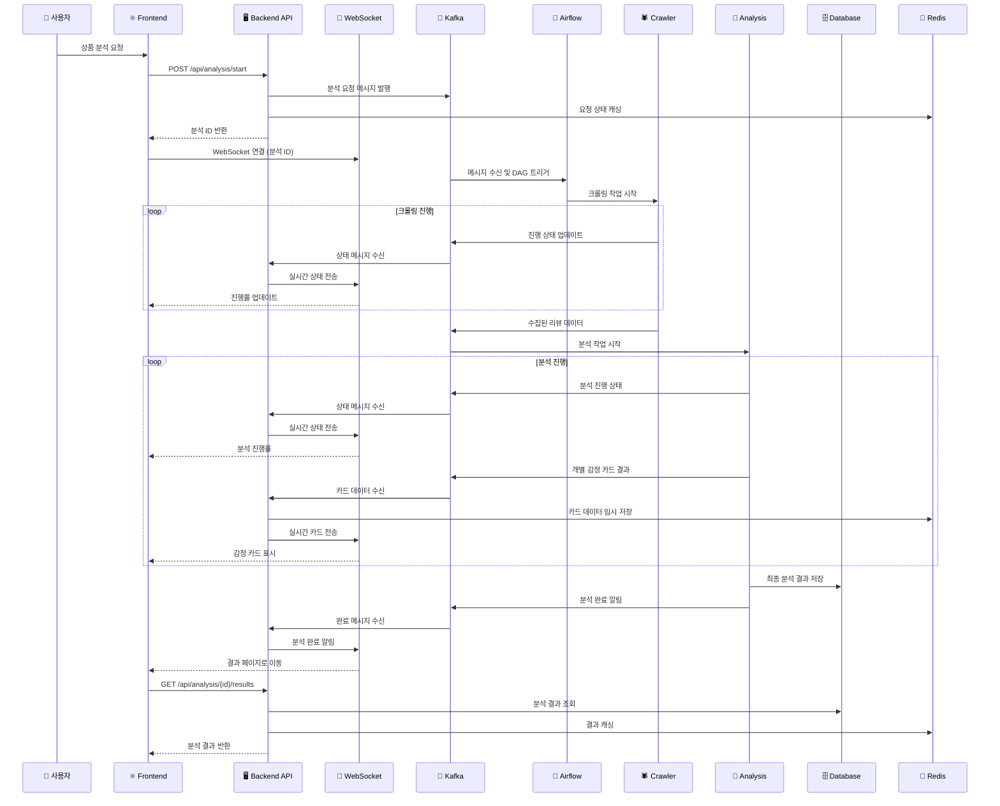
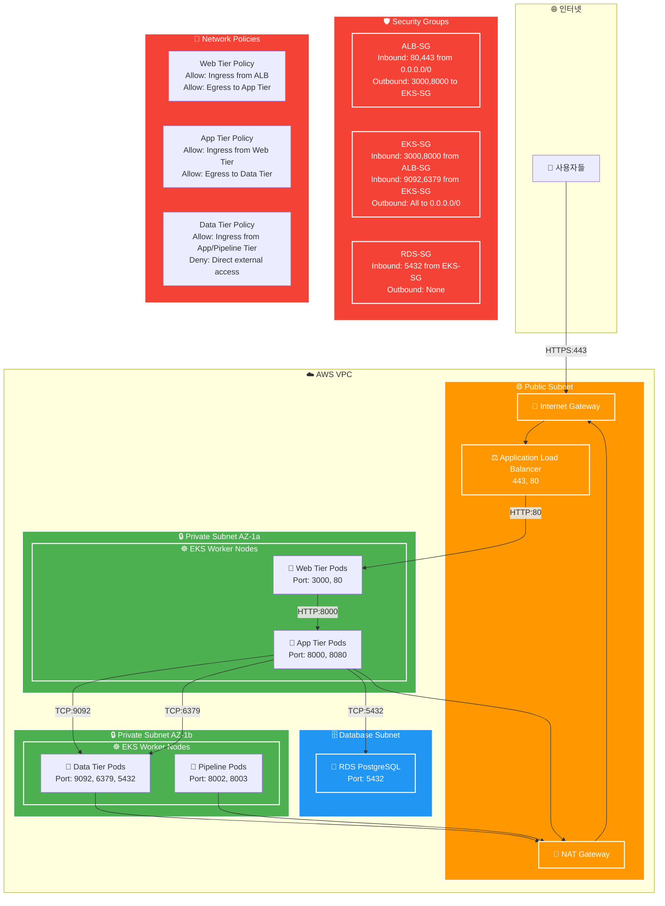
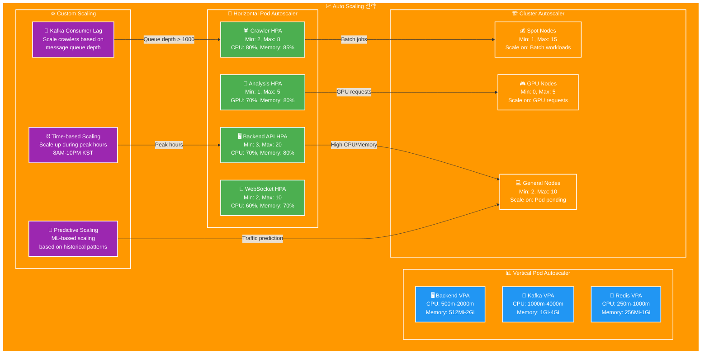

# HighPipe EKS 아키텍처 다이어그램

## 전체 시스템 아키텍처

```mermaid
graph TB
    %% External Components
    User[👤 사용자]
    Internet[🌐 인터넷]
    
    %% AWS Services
    subgraph AWS["☁️ AWS Cloud"]
        subgraph VPC["🏢 VPC"]
            subgraph PublicSubnet["🌐 Public Subnet"]
                ALB[⚖️ Application Load Balancer]
                NAT[🚪 NAT Gateway]
            end
            
            subgraph PrivateSubnet["🔒 Private Subnet"]
                subgraph EKS["☸️ EKS Cluster"]
                    
                    %% Web Tier Namespace
                    subgraph WebTier["📱 web-tier namespace"]
                        Frontend[⚛️ React Frontend<br/>Pods: 3]
                        Nginx[🔄 Nginx LoadBalancer<br/>Pods: 2]
                        Ingress[🚪 Ingress Controller]
                    end
                    
                    %% Application Tier Namespace
                    subgraph AppTier["🔧 app-tier namespace"]
                        BackendAPI[🖥️ Backend API<br/>Node.js<br/>Pods: 3-20 (HPA)]
                        WebSocket[🔌 WebSocket Server<br/>Pods: 2-10 (HPA)]
                        
                        subgraph AirflowCluster["🌊 Airflow Cluster"]
                            AirflowScheduler[📅 Scheduler<br/>Pod: 1]
                            AirflowWebserver[🌐 Webserver<br/>Pods: 2]
                            AirflowWorker[👷 Workers<br/>Pods: 2-10 (HPA)]
                        end
                    end
                    
                    %% Pipeline Tier Namespace
                    subgraph PipelineTier["🔄 pipeline-tier namespace"]
                        CrawlingServer[🕷️ Crawling Server<br/>FastAPI + Selenium<br/>Pods: 2-8 (HPA)]
                        AnalysisServer[🧠 LLM Analysis Server<br/>FastAPI + GPU<br/>Pods: 1-5 (HPA)]
                        SparkCluster[⚡ Spark Cluster<br/>Driver: 1, Executors: 2-10]
                    end
                    
                    %% Data Tier Namespace
                    subgraph DataTier["💾 data-tier namespace"]
                        subgraph KafkaCluster["📨 Kafka Cluster"]
                            Kafka1[📨 Kafka Broker 1]
                            Kafka2[📨 Kafka Broker 2]
                            Kafka3[📨 Kafka Broker 3]
                            Zookeeper[🐘 Zookeeper<br/>Pods: 3]
                        end
                        
                        Redis[🔴 Redis Cluster<br/>Master: 1, Slaves: 2]
                        PostgresProxy[🐘 PostgreSQL Proxy<br/>Connection Pooling]
                    end
                    
                    %% Monitoring Namespace
                    subgraph Monitoring["📊 monitoring namespace"]
                        Prometheus[📈 Prometheus<br/>Pod: 1]
                        Grafana[📊 Grafana<br/>Pod: 1]
                        AlertManager[🚨 AlertManager<br/>Pod: 1]
                    end
                end
            end
        end
        
        %% Managed AWS Services
        subgraph ManagedServices["🛠️ AWS Managed Services"]
            RDS[🗄️ RDS PostgreSQL<br/>Multi-AZ]
            S3[🪣 S3 Data Lake<br/>Raw Data Storage]
            Redshift[🏭 Redshift<br/>Data Warehouse]
            ECR[📦 ECR<br/>Container Registry]
            SecretsManager[🔐 Secrets Manager]
            CloudWatch[📊 CloudWatch Logs]
        end
    end
    
    %% Connections
    User --> Internet
    Internet --> ALB
    ALB --> Ingress
    Ingress --> Frontend
    Ingress --> BackendAPI
    Ingress --> AirflowWebserver
    
    Frontend --> BackendAPI
    BackendAPI --> WebSocket
    BackendAPI --> Redis
    BackendAPI --> PostgresProxy
    BackendAPI --> Kafka1
    
    AirflowScheduler --> AirflowWorker
    AirflowWorker --> CrawlingServer
    AirflowWorker --> AnalysisServer
    AirflowWorker --> SparkCluster
    
    CrawlingServer --> Kafka2
    AnalysisServer --> Kafka3
    SparkCluster --> S3
    SparkCluster --> Redshift
    
    Kafka1 --> Zookeeper
    Kafka2 --> Zookeeper
    Kafka3 --> Zookeeper
    
    PostgresProxy --> RDS
    
    %% Monitoring connections
    Prometheus --> BackendAPI
    Prometheus --> Kafka1
    Prometheus --> Redis
    Grafana --> Prometheus
    AlertManager --> Prometheus
    
    %% External connections
    BackendAPI --> SecretsManager
    CrawlingServer --> S3
    AnalysisServer --> S3
    
    %% Logging
    BackendAPI --> CloudWatch
    CrawlingServer --> CloudWatch
    AnalysisServer --> CloudWatch
    
    %% Styling
    classDef aws fill:#FF9900,stroke:#232F3E,stroke-width:2px,color:#fff
    classDef k8s fill:#326CE5,stroke:#fff,stroke-width:2px,color:#fff
    classDef app fill:#4CAF50,stroke:#fff,stroke-width:2px,color:#fff
    classDef data fill:#2196F3,stroke:#fff,stroke-width:2px,color:#fff
    classDef monitor fill:#FF5722,stroke:#fff,stroke-width:2px,color:#fff
    
    class AWS,ManagedServices aws
    class EKS,WebTier,AppTier,PipelineTier,DataTier k8s
    class Frontend,BackendAPI,WebSocket,CrawlingServer,AnalysisServer app
    class KafkaCluster,Redis,PostgresProxy,RDS,S3,Redshift data
    class Monitoring,Prometheus,Grafana,AlertManager monitor
```

## 노드 그룹 구성

```mermaid
graph TB
    subgraph EKSCluster["☸️ EKS Cluster"]
        subgraph GeneralNodeGroup["🖥️ General Node Group"]
            GeneralNode1[💻 m5.large<br/>General Workload<br/>2-4 vCPU, 8-16GB RAM]
            GeneralNode2[💻 m5.xlarge<br/>General Workload<br/>4 vCPU, 16GB RAM]
            GeneralNode3[💻 m5.large<br/>General Workload<br/>2-4 vCPU, 8-16GB RAM]
        end
        
        subgraph GPUNodeGroup["🎮 GPU Node Group"]
            GPUNode1[🎮 g4dn.xlarge<br/>LLM Analysis<br/>4 vCPU, 16GB RAM<br/>1x NVIDIA T4]
            GPUNode2[🎮 g4dn.2xlarge<br/>LLM Analysis<br/>8 vCPU, 32GB RAM<br/>1x NVIDIA T4]
        end
        
        subgraph DataNodeGroup["💾 Data Processing Node Group"]
            DataNode1[💾 r5.large<br/>Memory Intensive<br/>2 vCPU, 16GB RAM]
            DataNode2[💾 r5.xlarge<br/>Memory Intensive<br/>4 vCPU, 32GB RAM]
        end
        
        subgraph SpotNodeGroup["💰 Spot Node Group"]
            SpotNode1[💰 m5.large (Spot)<br/>Batch Processing<br/>2-4 vCPU, 8-16GB RAM]
            SpotNode2[💰 c5.xlarge (Spot)<br/>CPU Intensive<br/>4 vCPU, 8GB RAM]
        end
    end
    
    %% Workload placement
    GeneralNode1 --> Frontend
    GeneralNode1 --> BackendAPI
    GeneralNode2 --> WebSocket
    GeneralNode2 --> AirflowWebserver
    GeneralNode3 --> Nginx
    GeneralNode3 --> Ingress
    
    GPUNode1 --> AnalysisServer
    GPUNode2 --> MLTraining[🤖 ML Model Training]
    
    DataNode1 --> Kafka
    DataNode1 --> Redis
    DataNode2 --> SparkDriver[⚡ Spark Driver]
    
    SpotNode1 --> CrawlingServer
    SpotNode1 --> SparkExecutor[⚡ Spark Executors]
    SpotNode2 --> BatchJobs[📦 Batch Processing Jobs]
    
    classDef general fill:#4CAF50,stroke:#fff,stroke-width:2px,color:#fff
    classDef gpu fill:#FF5722,stroke:#fff,stroke-width:2px,color:#fff
    classDef data fill:#2196F3,stroke:#fff,stroke-width:2px,color:#fff
    classDef spot fill:#FF9800,stroke:#fff,stroke-width:2px,color:#fff
    
    class GeneralNode1,GeneralNode2,GeneralNode3 general
    class GPUNode1,GPUNode2 gpu
    class DataNode1,DataNode2 data
    class SpotNode1,SpotNode2 spot
```

## 데이터 플로우 다이어그램



## 네트워크 보안 다이어그램



## Auto Scaling 전략



이 다이어그램들은 HighPipe 프로젝트의 EKS 기반 아키텍처를 시각적으로 보여줍니다. 각 컴포넌트의 역할과 상호작용, 그리고 확장성과 보안을 고려한 설계를 확인할 수 있습니다.