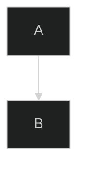
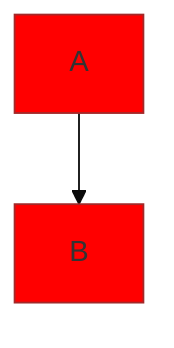

# Mermaid 다이어그램 시각화 가이드

## 🌐 온라인 도구들

### 1. Mermaid Live Editor (추천)
- URL: https://mermaid.live/
- 실시간 편집 및 미리보기
- PNG, SVG, PDF 내보내기 가능
- 공유 링크 생성 가능

### 2. Mermaid.js 공식 에디터
- URL: https://mermaid-js.github.io/mermaid-live-editor/
- 다양한 테마 지원
- 코드 복사/붙여넣기 간편

### 3. Draw.io (Diagrams.net)
- URL: https://app.diagrams.net/
- Mermaid 코드 import 지원
- 추가 편집 및 스타일링 가능

## 💻 로컬 도구들

### 1. VS Code 확장 프로그램
```bash
# 확장 프로그램 설치 (VS Code Extensions)
- Mermaid Preview (bierner.markdown-mermaid)
- Markdown Preview Enhanced (shd101wyy.markdown-preview-enhanced)
```

### 2. Node.js CLI 도구
```bash
# Mermaid CLI 설치
npm install -g @mermaid-js/mermaid-cli

# PNG로 변환
mmdc -i docs/eks-architecture-diagram.md -o docs/architecture.png

# SVG로 변환
mmdc -i docs/eks-architecture-diagram.md -o docs/architecture.svg -f svg

# PDF로 변환
mmdc -i docs/eks-architecture-diagram.md -o docs/architecture.pdf -f pdf
```

### 3. Python 도구
```bash
# Python 패키지 설치
pip install mermaid-py

# Python 스크립트로 변환
python -c "
import mermaid
with open('docs/eks-architecture-diagram.md', 'r') as f:
    content = f.read()
mermaid.render(content, 'docs/architecture.png')
"
```

## 🔧 통합 도구들

### 1. Notion
- Mermaid 코드 블록 지원
- 팀 협업에 유용

### 2. Confluence
- Mermaid 매크로 설치 필요
- 기업 문서화에 적합

### 3. GitBook
- 네이티브 Mermaid 지원
- 기술 문서 작성에 최적

### 4. Obsidian
- Mermaid 플러그인 지원
- 개인 지식 관리에 유용

## 📱 모바일 앱

### 1. Mermaid Chart (iOS/Android)
- 모바일에서 다이어그램 편집
- 클라우드 동기화 지원

## 🎨 커스터마이징 옵션

### 테마 변경


### 색상 커스터마이징


## 📤 내보내기 형식

### 지원 형식
- **PNG**: 웹 사용, 프레젠테이션
- **SVG**: 벡터 그래픽, 확대/축소 무손실
- **PDF**: 문서 첨부, 인쇄
- **HTML**: 웹 페이지 임베드

### 품질 설정
```bash
# 고해상도 PNG 생성
mmdc -i input.md -o output.png -w 2048 -H 1536

# 배경 투명 PNG
mmdc -i input.md -o output.png -b transparent
```

## 🚀 빠른 시작 가이드

1. **온라인에서 바로 보기**
   - https://mermaid.live/ 접속
   - 다이어그램 코드 복사/붙여넣기
   - 실시간 미리보기 확인

2. **VS Code에서 보기**
   - Mermaid Preview 확장 설치
   - `.md` 파일 열기
   - `Ctrl+Shift+P` → "Mermaid: Preview"

3. **이미지로 저장**
   - 온라인 에디터에서 "Export" 클릭
   - 원하는 형식 선택 (PNG/SVG/PDF)
   - 다운로드

## 💡 팁과 트릭

### 1. 성능 최적화
- 큰 다이어그램은 여러 개로 분할
- 불필요한 노드 연결 최소화
- 적절한 레이아웃 방향 선택

### 2. 가독성 향상
- 의미있는 노드 ID 사용
- 적절한 색상 구분
- 클래스 스타일 활용

### 3. 협업 효율성
- 공유 가능한 링크 생성
- 버전 관리 시스템 활용
- 주석과 설명 추가

## 🔗 유용한 링크

- [Mermaid 공식 문서](https://mermaid-js.github.io/mermaid/)
- [Mermaid Live Editor](https://mermaid.live/)
- [Mermaid CLI GitHub](https://github.com/mermaid-js/mermaid-cli)
- [VS Code Mermaid Preview](https://marketplace.visualstudio.com/items?itemName=bierner.markdown-mermaid)