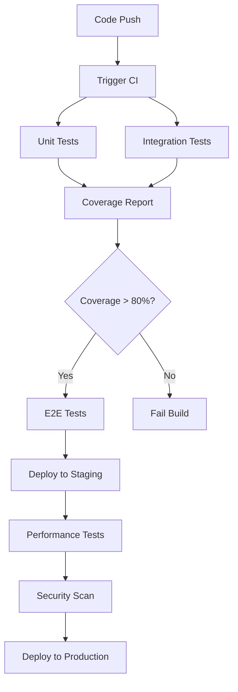

# 테스트 전략 문서

## 1. 개요

본 문서는 리뷰 기반 실시간 감정 분석 및 요약 서비스의 테스트 전략을 정의합니다. 프론트엔드, 백엔드, 통합 테스트 및 E2E 테스트를 포함한 포괄적인 테스트 계획을 수립하여 서비스의 품질과 안정성을 보장합니다.

## 2. 테스트 범위 및 우선순위

### 2.1 테스트 피라미드

```
    /\
   /  \     E2E Tests (10%)
  /____\    - 핵심 사용자 플로우
 /      \   Integration Tests (20%)
/________\  - API 통합, 서비스 간 연동
Unit Tests (70%)
- 개별 함수/컴포넌트
```

### 2.2 우선순위별 테스트 범위

#### 🔴 High Priority (Critical)
- **사용자 인증**: 로그인, 회원가입, JWT 토큰 관리
- **분석 요청**: 단일/다중 상품 분석 API
- **실시간 통신**: WebSocket 연결 및 상태 업데이트
- **데이터 저장**: 분석 결과 저장 및 조회

#### 🟡 Medium Priority (Important)
- **캐시 시스템**: Redis 캐싱 로직
- **에러 핸들링**: API 에러 응답 및 사용자 알림
- **UI 컴포넌트**: 주요 React 컴포넌트
- **Airflow 연동**: DAG 트리거 및 상태 조회

#### 🟢 Low Priority (Nice to have)
- **성능 테스트**: 부하 테스트 및 응답 시간
- **접근성 테스트**: 웹 접근성 준수
- **브라우저 호환성**: 크로스 브라우저 테스트

## 3. 테스트 도구 및 프레임워크

### 3.1 백엔드 테스트

| 테스트 유형 | 도구 | 용도 |
|------------|------|------|
| Unit Tests | Jest | 개별 함수/모듈 테스트 |
| Integration Tests | Jest + Supertest | API 엔드포인트 테스트 |
| Database Tests | Jest + Test DB | 데이터베이스 연동 테스트 |
| Mock Tests | Jest Mocks | 외부 서비스 모킹 |

### 3.2 프론트엔드 테스트

| 테스트 유형 | 도구 | 용도 |
|------------|------|------|
| Unit Tests | Jest + React Testing Library | 컴포넌트 단위 테스트 |
| Integration Tests | Jest + MSW | API 통합 테스트 |
| Snapshot Tests | Jest | UI 회귀 테스트 |
| Accessibility Tests | jest-axe | 접근성 테스트 |

### 3.3 E2E 테스트

| 테스트 유형 | 도구 | 용도 |
|------------|------|------|
| E2E Tests | Cypress | 전체 사용자 플로우 테스트 |
| Visual Tests | Cypress + Percy | 시각적 회귀 테스트 |
| Performance Tests | Lighthouse CI | 성능 측정 |

## 4. 테스트 환경 구성

### 4.1 테스트 환경 분리

```
Development → Testing → Staging → Production
     ↓           ↓         ↓          ↓
  Unit Tests  Integration  E2E Tests  Monitoring
              Tests
```

### 4.2 테스트 데이터베이스

- **Unit Tests**: In-memory SQLite
- **Integration Tests**: Docker PostgreSQL
- **E2E Tests**: Dedicated test database

### 4.3 Mock 서비스

- **Airflow API**: Mock server with predefined responses
- **Kafka**: In-memory Kafka for testing
- **Redis**: Redis Mock for caching tests
- **External APIs**: MSW (Mock Service Worker)

## 5. CI/CD 통합

### 5.1 GitHub Actions 워크플로우

```yaml
name: Test Pipeline
on: [push, pull_request]

jobs:
  backend-tests:
    - Unit Tests
    - Integration Tests
    - Coverage Report
  
  frontend-tests:
    - Unit Tests
    - Component Tests
    - Build Tests
  
  e2e-tests:
    - Cypress E2E Tests
    - Visual Regression Tests
  
  quality-gates:
    - Code Coverage > 80%
    - No Critical Security Issues
    - Performance Budget Check
```

### 5.2 테스트 실행 전략

- **PR 생성 시**: Unit + Integration Tests
- **Main 브랜치 머지 시**: Full Test Suite + E2E
- **Release 브랜치**: Performance + Security Tests
- **Nightly**: Full Regression Test Suite

## 6. 코드 커버리지 목표

### 6.1 커버리지 기준

| 컴포넌트 | 목표 커버리지 | 최소 커버리지 |
|----------|---------------|---------------|
| Backend Services | 90% | 80% |
| API Routes | 85% | 75% |
| Frontend Components | 80% | 70% |
| Utility Functions | 95% | 85% |

### 6.2 커버리지 리포팅

- **도구**: Istanbul (nyc) + Codecov
- **리포트**: HTML, JSON, LCOV 형식
- **통합**: GitHub PR 코멘트에 자동 리포트

## 7. 테스트 시나리오

### 7.1 핵심 E2E 시나리오

#### 시나리오 1: 사용자 회원가입 및 로그인
```gherkin
Given 사용자가 회원가입 페이지에 접근
When 유효한 이메일과 비밀번호를 입력하고 가입
Then 계정이 생성되고 로그인 페이지로 이동
When 생성된 계정으로 로그인
Then 대시보드 페이지로 이동하고 JWT 토큰이 저장됨
```

#### 시나리오 2: 상품 검색 및 분석 요청
```gherkin
Given 로그인된 사용자가 메인 페이지에 있음
When "아이폰 15"를 검색
Then 관련 상품 목록이 표시됨
When 첫 번째 상품의 "분석 시작" 버튼을 클릭
Then 분석 진행 상태가 실시간으로 표시됨
And 분석 완료 후 결과 페이지로 이동
```

#### 시나리오 3: 실시간 분석 상태 업데이트
```gherkin
Given 분석이 진행 중인 상태
When WebSocket을 통해 상태 업데이트가 수신됨
Then 진행률 바가 업데이트됨
And 현재 단계가 표시됨
When 분석이 완료됨
Then 완료 알림이 표시되고 결과가 로드됨
```

### 7.2 API 통합 테스트 시나리오

#### 인증 API 테스트
- 회원가입 성공/실패 케이스
- 로그인 성공/실패 케이스
- JWT 토큰 검증 및 갱신
- 로그아웃 처리

#### 분석 API 테스트
- 단일 상품 분석 요청
- 다중 상품 분석 요청
- 관심 상품 분석 요청
- 분석 상태 조회
- 분석 결과 조회

#### Airflow 연동 테스트
- DAG 트리거 성공/실패
- DAG 상태 조회
- 에러 핸들링

## 8. 성능 테스트

### 8.1 성능 기준

| 메트릭 | 목표 | 임계값 |
|--------|------|--------|
| API 응답 시간 | < 200ms | < 500ms |
| 페이지 로드 시간 | < 2초 | < 3초 |
| 동시 사용자 | 100명 | 50명 |
| 메모리 사용량 | < 512MB | < 1GB |

### 8.2 부하 테스트 시나리오

- **점진적 부하**: 1 → 100 사용자 (10분간)
- **스파이크 테스트**: 순간 200 사용자
- **지속 부하**: 50 사용자 (30분간)
- **스트레스 테스트**: 한계점 탐지

## 9. 보안 테스트

### 9.1 보안 테스트 항목

- **인증/인가**: JWT 토큰 보안
- **입력 검증**: SQL Injection, XSS 방지
- **API 보안**: Rate Limiting, CORS
- **데이터 보호**: 민감 정보 암호화
- **의존성 보안**: npm audit, Snyk

### 9.2 보안 도구

- **SAST**: ESLint Security Plugin
- **DAST**: OWASP ZAP
- **Dependency Check**: npm audit, Snyk
- **Secret Scanning**: GitLeaks

## 10. 테스트 자동화 및 리포팅

### 10.1 자동화 워크플로우



### 10.2 알림 및 리포팅

- **Slack 통합**: 테스트 실패 시 즉시 알림
- **Email 리포트**: 일일 테스트 요약
- **Dashboard**: 실시간 테스트 상태 모니터링
- **Metrics**: 테스트 성공률, 커버리지 추이

## 11. 테스트 유지보수

### 11.1 테스트 리뷰 프로세스

- **코드 리뷰**: 모든 테스트 코드 리뷰 필수
- **정기 점검**: 월 1회 테스트 케이스 검토
- **성능 모니터링**: 테스트 실행 시간 추적
- **플레이키 테스트**: 불안정한 테스트 식별 및 수정

### 11.2 테스트 문서화

- **테스트 케이스 문서**: 각 테스트의 목적과 범위
- **설정 가이드**: 로컬 테스트 환경 구성
- **트러블슈팅**: 일반적인 테스트 문제 해결
- **베스트 프랙티스**: 팀 내 테스트 작성 가이드

## 12. 결론

이 테스트 전략을 통해 다음을 달성합니다:

- **품질 보장**: 높은 코드 커버리지와 포괄적인 테스트
- **빠른 피드백**: CI/CD 파이프라인을 통한 즉시 테스트 결과
- **안정성 확보**: 자동화된 회귀 테스트로 버그 방지
- **성능 최적화**: 지속적인 성능 모니터링
- **보안 강화**: 자동화된 보안 테스트

정기적인 전략 검토와 업데이트를 통해 변화하는 요구사항에 대응하고, 테스트의 효율성을 지속적으로 개선해 나갑니다.